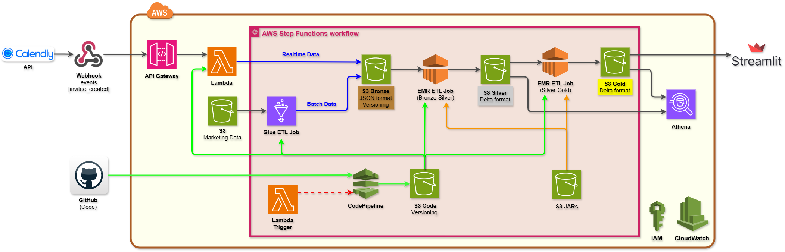

# ELT_Project 6: Marketing & Calendly Data Engineering???

## 🧠 Overview
This project implements a production-ready data engineering pipeline using AWS Glue, Delta Lake, and S3 to process marketing and Calendly data.

### The pipeline enables:
- Ingestion of raw marketing and Calendly events **(🟤 Bronze layer)** 
- Data cleaning, transformation, and deduplication **(⚪ Silver layer)**  
- Curated Delta tables ready for analytics and visualization **(🟡 Gold layer)**  
- Incremental updates and reliable orchestration via Glue Workflows  

## 🎯 Business Objective  
Organizations need insights into marketing campaigns and meeting scheduling to optimize spend and improve conversions.  

This project addresses:    
✔️ Tracking daily bookings from Calendly per marketing channel  
✔️ Calculating Cost Per Booking (CPB) to identify cost-efficient campaigns  
✔️ Understanding booking trends, channel attribution, and employee workload  
✔️ Providing a robust, Delta Lake-based data pipeline for analytics and dashboards  

## 🧩 Architecture

```text
Calendly Webhooks & Marketing Spend Data
   ↓ (Glue Job – ETL)
AWS Glue
   ↓
Bronze Layer (Raw JSON in S3)
   ↓
Silver Layer (Cleaned & Flattened Data)
   ↓
Gold Layer (Curated Delta Lake Tables)
   ↓
Analytics & Visualization (Streamlit Dashboard)
```

## 🛢️ Data Sources
1️⃣ **Calendly Webhooks:** event-based booking data (invitee.created)
Includes attendee info, scheduled event details, timezone, UTM parameters  
#### 📄 Sample Invitee Event
Below is an example of a Calendly Webhook invitee.curated event:  
[6705dded-8f97-4cea-8d12-491e10d8bcd5.json](6705dded-8f97-4cea-8d12-491e10d8bcd5.json)

2️⃣ **Marketing Spend Data:** daily spend per campaign in JSON from S3  

**Event types per campaign:**
- Facebook Paid Ads
- YouTube Paid Ads
- TikTok Paid Ads

#### 📄 Sample Marketing data (Youtube)
[spend-date-2026-01-14.json](spend-date-2026-01-14.json)
```json
[
  {
    "date": "2026-01-14",
    "channel": "youtube_paid_ads",
    "spend": 827.67
  },
  {
    "date": "2026-01-14",
    "channel": "facebook_paid_ads",
    "spend": 529.79
  },
  {
    "date": "2026-01-14",
    "channel": "tiktok_paid_ads",
    "spend": 327.92
  }
]
```
## ➡️ ETL Layers
**🟫 Bronze Layer:** Raw Calendly webhook events & marketing spend JSON  
**⬜ Silver Layer:** Flattened, cleaned, type-cast, deduplicated data  
**🟨 Gold Layer:** Curated Delta tables for analytics and dashboard visualization  

## 📊 Key Metrics & Business Insights
✅ Daily Calls Booked by Source – count of Calendly bookings per source per day  
✅ Cost Per Booking (CPB) by Channel – total spend divided by total bookings  
✅ Booking Trends Over Time – monitor daily/weekly booking volume per source  
✅ Channel Attribution – attribute bookings to campaigns via UTM parameters  
✅ Booking Volume by Time Slot / Day of Week – identify peak booking periods  
✅ Employee Meeting Load – weekly average meetings per employee  

## 📄 Sample Data
```
Calendly Webhook Event (Bronze Layer):     invitee_created_202601114.json   
Flattened & Cleaned Event (Silver Layer):  silver_event_202601114.delta   
Curated Delta Table (Gold Layer):          gold_event_202601114.delta
``` 

## 🌟 Results
☑️ Raw Calendly & marketing data ingested successfully  
☑️ Bronze → Silver → Gold transformations applied with Delta Lake  
☑️ Metrics such as CPB, booking trends, and employee load calculated  
☑️ Interactive Streamlit dashboard created for visualization  
☑️ Serverless orchestration with AWS Glue workflows implemented
☑️ Near real-time streaming ingestion of Calendly events  
☑️ CI/CD pipeline for automated deployment  

## 🔜 Future Enhancements
💡 Automated anomaly detection on booking trends  

## 🧑🏻‍💻 Author
**Hadi Hosseini**  
Data Engineer | AI/ML Engineer | Biomedical Data Scientist  
➡️ www.linkedin.com/in/hadi468
